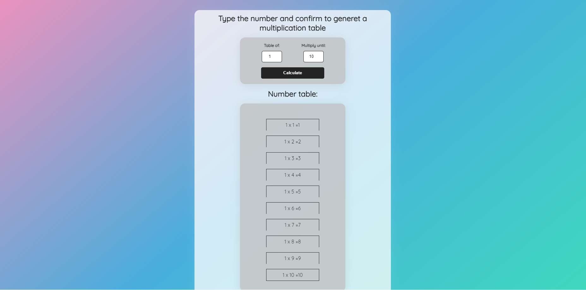
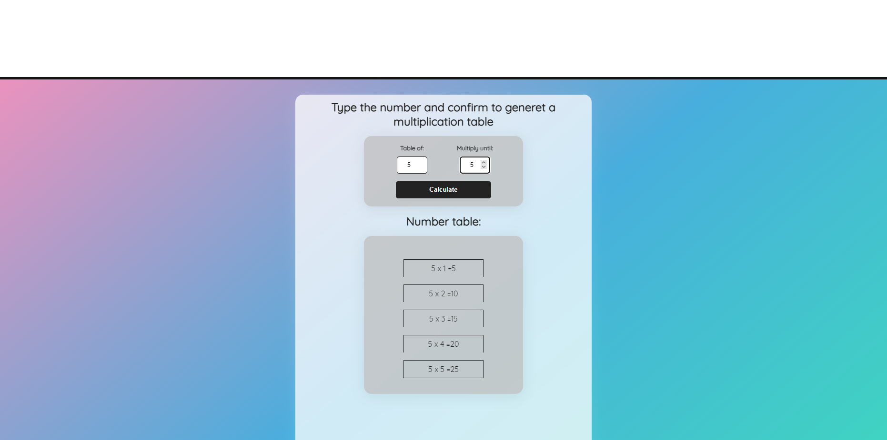
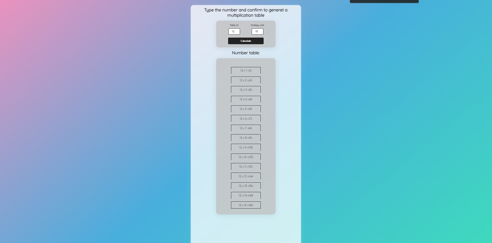
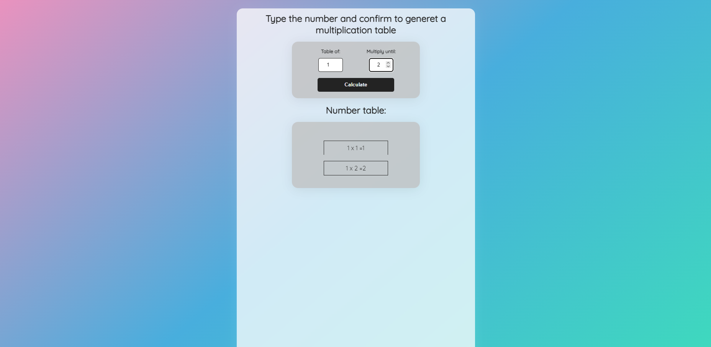

<h1 align="center"> Multiplication Table</h1>

Just a multiplication table.   

  <a href="#-tecnologias">Techs/Tecnologias</a>&nbsp;&nbsp;&nbsp;|&nbsp;&nbsp;&nbsp;
  <a href="#-projeto">Project/Projeto</a>&nbsp;&nbsp;&nbsp;|&nbsp;&nbsp;&nbsp;
  <a href="#-layout">Layout</a>&nbsp;&nbsp;&nbsp;|&nbsp;&nbsp;&nbsp;
  <a href="#memo-licença">License/Licença</a>

  

  

  

  

## 🚀 Techs / Tecnologias

Esse projeto foi desenvolvido com as seguintes tecnologias:

- HTML e CSS
- JavaScript
- Git e Github

## 💻 Project / Projeto

Uma tabela de multiplicação que mostra os resultados referentes a quantidade que você escolher, sobre o número que você preencheu.

A simple multiplication table that shows whatever the results for the quantity you choose, about the number you put.

## 🔖 Layout

Você pode visualizar o layout do projeto através do repositório. 
